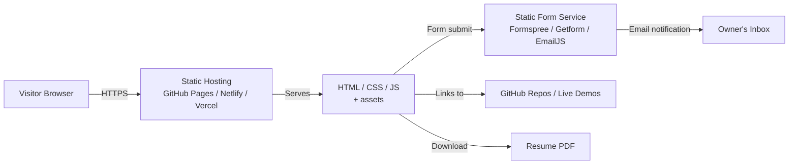
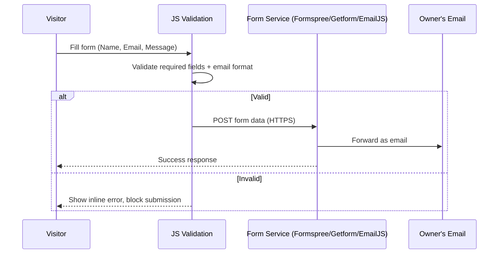

# System Design Document

### Portfolio Website — Ezza Tahir

| | |
|---|---|
| **Prepared by** | Ezza Tahir |
| **Document version** | 1.0 |
| **Status** | Draft |
| **Related documents** | `docs/VisionScope.md`, `docs/SRS.md` |

---

## 1. Introduction

### 1.1 Purpose

This document describes the system design of the portfolio website: its architecture, component breakdown, data design, and deployment approach. It translates the requirements in `SRS.md` into a concrete technical design.

### 1.2 Design Goals

- Fully static, front-end-only architecture (no custom backend)
- Simple enough to maintain solo, without a build pipeline if not needed
- Fast load time and clean separation between content, structure, and styling
- Easy to extend with new projects without touching layout code

## 2. System Architecture

The site is a static single-page or multi-section application. All content is served as static assets (HTML/CSS/JS) from free static hosting. The only external dependency is a third-party form-handling service for the contact form.



### 2.1 Architecture Style

- **Type**: Static site (no server-side rendering, no database)
- **Hosting**: GitHub Pages, Netlify, or Vercel (free tier)
- **State**: Client-side only (theme preference stored in `localStorage`)
- **Content updates**: Direct edits to HTML/data files, committed via Git

## 3. Component Design

Each section from the SRS maps to a page section or component:

| Component | Requirement(s) | Responsibility |
|---|---|---|
| Navbar | FR1–FR8 | Persistent navigation between sections, includes dark/light toggle |
| Hero / Home | FR1 | Name, tagline, short intro, call-to-action buttons (Projects, Resume, Contact) |
| About | FR2 | Education, background narrative |
| Skills | FR3 | Skills grouped by category (languages, frameworks, databases, tools) |
| Certifications | FR4 | List of completed certifications |
| Projects Grid | FR5 | Project cards: title, short description, tech tags, links |
| Project Case Study | FR6 | Expanded view for flagship projects: problem, approach, stack, outcome |
| Resume | FR7 | Embedded PDF viewer + download button |
| Contact Form | FR8, FR9, FR10 | Form fields, client-side validation, submission to static form service |
| Theme Toggle | FR11 | Switches CSS theme, persists choice in `localStorage` |

### 3.1 Contact Form Flow



## 4. Data Design

No database is used. Project and skill data are stored as static structured data (e.g. a JSON or JS file) and rendered into the page, so new projects can be added without touching layout markup.

Example `projects.json` shape:

```json
{
  "id": "campusway",
  "title": "CampusWay",
  "summary": "Native Android indoor campus navigation app",
  "category": "flagship",
  "stack": ["Java", "Android", "SQLite"],
  "repoUrl": "https://github.com/...",
  "demoUrl": "",
  "caseStudy": {
    "problem": "...",
    "approach": "...",
    "outcome": "..."
  }
}
```

Skills, certifications, and general project entries follow the same pattern — each a simple structured object read by the front-end to render its section.

## 5. UI Design

- Single persistent navbar with anchor links to each section (Home, About, Skills, Projects, Certifications, Resume, Contact)
- One consistent color and typography system across all sections, defined as CSS variables/tokens for easy dark/light theming (ties into FR11)
- Project cards use a consistent layout: title, tags, short description, and link buttons
- Flagship projects link from their card into a dedicated case-study section/page
- Wireframes and mockups referenced from `design/wireframes/`

## 6. Folder / Repository Structure

Matches the repository layout already in use:

```
portfolio-website/
├── docs/                  # All official documents
│   ├── VisionScope.md
│   ├── SRS.md
│   ├── SDD.md
│   ├── ProjectPlan.md
│   ├── TestPlan.md
│   └── DeploymentNotes.md
├── design/
│   ├── wireframes/
│   └── diagrams/
├── src/
│   ├── frontend/          # HTML, CSS, JS
│   ├── backend/           # Not used in Release 1 (see Section 2.1)
│   └── assets/            # Images, icons, fonts, resume PDF
```

`src/backend/` stays empty/unused for Release 1, consistent with the no-backend decision in `VisionScope.md`; it's kept in the structure only in case a future release adds server-side features.

## 7. Third-Party Integrations

| Integration | Purpose | Notes |
|---|---|---|
| Formspree / Getform / EmailJS | Contact form submission | No API key exposed beyond what the service requires client-side |
| GitHub Pages / Netlify / Vercel | Static hosting & deployment | Free tier, HTTPS by default |
| Google Fonts (optional) | Typography | Loaded via `<link>`, no build step required |

## 8. Deployment Architecture

- Source lives in this GitHub repository
- `src/frontend/` is built (if using a bundler) or used directly as static files
- Hosting platform watches the repo (or a specific branch, e.g. `main` or `gh-pages`) and redeploys automatically on push
- No environment variables or secrets required for Release 1, since there's no backend and the form service uses a public form endpoint

Full deployment steps are covered in `docs/DeploymentNotes.md`.

## 9. Traceability to Requirements

| SDD Section | SRS Requirement(s) |
|---|---|
| 3. Component Design | FR1–FR11 |
| 3.1 Contact Form Flow | FR8, FR9, FR10, NFR4 |
| 4. Data Design | FR5, FR6 |
| 5. UI Design | NFR1, NFR3, FR11 |
| 8. Deployment Architecture | NFR2, NFR5, NFR6 |
